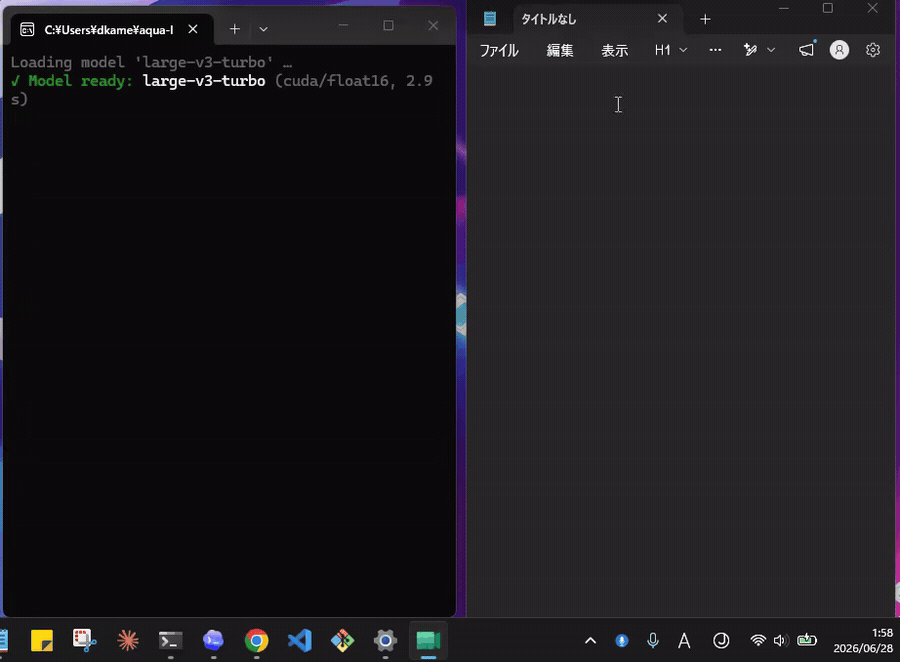

# Koe 声 🎙️

**English** | [日本語](README.ja.md)

**Local, offline voice dictation for Windows.** Hold (or tap) a key, speak, and clean
text is typed into whatever app has focus. Your speech is transcribed **on your own
machine** — nothing is ever sent to the cloud.

<p align="center"></p>

> Thesis: **anyone can use it, everyone stays safe.** Free, offline, no account, no
> telemetry. Inspired by [Aqua Voice](https://withaqua.com/), rebuilt to run 100% locally.

- 🔒 **100% local** — no cloud, no API keys, no telemetry. Works offline after the first model download.
- ⚡ **Fast** — `faster-whisper` (CTranslate2) on CUDA; near real-time on a decent NVIDIA GPU.
- 🌐 **JP / EN** — the Whisper `large-v3` family handles Japanese and English (auto-detected).
- 🧹 **Smart, minimal cleanup** — a local LLM (via Ollama) removes fillers and adds
  punctuation while **preserving your exact wording** (and never translating).
- 🧠 **Context grounding** — reads the focused window/field locally to spell proper nouns
  and code identifiers correctly.
- 📚 **Self-healing dictionary** — teach it a correction once; it fixes that term forever.
- 🎚️ **Preroll capture** — an always-on ring buffer prepends the moment *before* you
  press the key, so the first word is never clipped ("…ello" → "Hello").
- ⌨️ **Types anywhere** — Unicode-safe injection into any Windows app.

## Requirements

- **Windows 10/11**
- **Python 3.12**
- **NVIDIA GPU** strongly recommended (falls back to CPU automatically, but slower)
- *(optional)* **[Ollama](https://ollama.com)** for the local LLM cleanup layer

## Install

### Option A — download the app (no Python, no git)

1. Grab **`Koe-win64-cuda.zip`** from the [latest release](https://github.com/dkamehat/Koe/releases/latest).
2. Unzip it anywhere.
3. Double-click **`Koe.exe`**. The first launch downloads the Whisper model once, then runs offline.

`config.json` and `dictionary.txt` are created next to `Koe.exe`, so the app stays
self-contained and portable.

### Option B — run from source (for developers)

```powershell
git clone https://github.com/dkamehat/Koe.git
cd Koe
.\setup.ps1
```

`setup.ps1` creates a `.venv` and installs everything (including the CUDA libraries).
Downloads ~1–2 GB.

To build the standalone app yourself: `.\build.ps1` → `dist\Koe\Koe.exe`.

*(Optional but recommended)* enable the local LLM cleanup:

```powershell
# install Ollama from https://ollama.com, then:
ollama pull qwen2.5:7b
```

## Run

```powershell
.\run-admin.bat        # runs as Administrator so global hotkeys work everywhere
```

The first launch downloads the Whisper model once (cached under
`~/.cache/huggingface`), then runs fully offline. A microphone icon appears in the
system tray (look under the `^` overflow on Windows 11).

**Usage:** with the default **toggle** mode, press **Right Ctrl** once to start, speak
(pause and think freely), press again to stop → cleaned text appears in the focused app.
Right-click the tray icon for settings; use `run.py --console` for a plain terminal.

## The ③ Refiner — context-aware cleanup (pluggable, local-first)

| `refiner_backend` | What it does | Privacy / cost |
|-------------------|--------------|----------------|
| `auto` (default)  | Local Ollama **if running**, else `rules` | 100% local |
| `rules`           | Deterministic formatting, no LLM | 100% local, instant |
| `ollama`          | Local LLM (e.g. `qwen2.5:7b`) on your GPU | **100% local, free** |
| `claude`          | Anthropic API | cloud, metered, needs `ANTHROPIC_API_KEY` |
| `openai`          | OpenAI API | cloud, metered, needs `OPENAI_API_KEY` |

**Safety:** cloud backends are never used unless you explicitly select them, and API keys
are read from **environment variables only** — never stored in `config.json`, so a shared
config can't leak a key or silently phone home. Context grounding is **automatically
disabled when a cloud refiner is selected**, so on-screen text never leaves your machine.

> A ChatGPT/Claude **subscription is not the same as developer API access** (the API is
> billed separately). For zero-cost + high accuracy, use the local **`ollama`** backend.

## Dictionary & the improvement loop

Add proper nouns / jargon to `dictionary.txt` (created on first run; see
`dictionary.txt.example`) so they transcribe correctly. When something comes out wrong,
open **「直前の出力を修正（学習）…」** from the tray, enter the misheard word and its
correct form — it's saved and auto-corrected from then on, all on-device.

## Configuration — `config.json`

Created on first run. Key options:

| Field             | Default                | Notes |
|-------------------|------------------------|-------|
| `model`           | `large-v3-turbo`       | `small` / `medium` / `large-v3` for lighter/heavier machines |
| `language`        | `null`                 | `"ja"`, `"en"`, or `null` to auto-detect |
| `hotkey`          | `right ctrl`           | e.g. `right alt`, `f9` |
| `hotkey_mode`     | `toggle`               | `toggle` (tap on/off) or `ptt` (hold) |
| `refiner_backend` | `auto`                 | `rules` / `ollama` / `claude` / `openai` |
| `stream_output`   | `true`                 | type each sentence as it's ready (faster feel) |
| `enable_context`  | `true`                 | read focused window/field for grounding |
| `enable_preroll`  | `true`                 | always-on mic ring buffer so the first word isn't clipped |
| `preroll_sec`     | `0.3`                  | how much pre-keypress audio to prepend |

## Measuring quality on your own voice (`bench.py`)

"Good enough" is personal, so make changes *comparable* instead of guessing:

```powershell
python bench.py record "the exact text you'd accept"   # record a sample (Enter to stop)
python bench.py run                                     # score all samples (shows CER + diffs)
python bench.py run --model large-v3 --refiner rules    # quick A/B without editing config
```

Samples live in `./bench/` and are gitignored — your voice never leaves the machine.

## How it works

```
 mic ─► record ─► faster-whisper ─► dictionary ─► ③ refiner ─► clipboard paste ─► app
          ①          ②(CUDA)        proper nouns   local LLM     Unicode-safe       ④
                                                  (context-grounded, streamed)
```

## Troubleshooting

- **Keys not captured** → run via `run-admin.bat` (Administrator).
- **Wrong microphone** → `python run.py --list-devices`, then set `input_device` in `config.json`.
- **Hotkey doesn't fire** → `python run.py --diagnose-keys`, press the key, use the printed name.
- **CUDA load failed** → it auto-falls back to CPU (`int8`); try `model: "small"`.
- **Paste doesn't land** → some apps block programmatic paste; set `output_mode: "type"`.

## Credits & License

Inspired by [Aqua Voice](https://withaqua.com/). Built with
[faster-whisper](https://github.com/SYSTRAN/faster-whisper) and [Ollama](https://ollama.com).
Not affiliated with or endorsed by Aqua Voice.

MIT — see [LICENSE](LICENSE).
